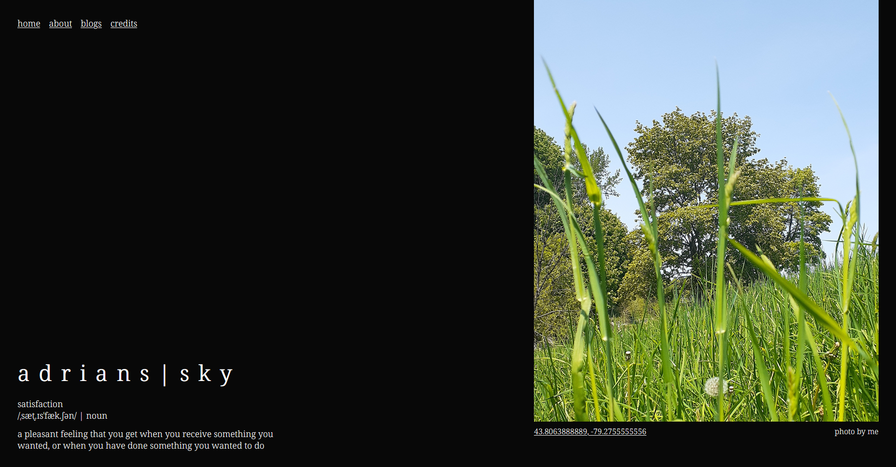
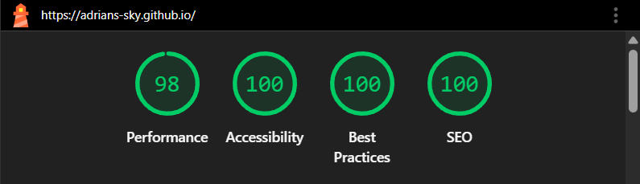

# adrians-sky.github.io

My personal, "not boring" portfolio and personal blog 
[website](https://adrians-sky.github.io). 

---

# Lighthouse Insights

> Generated on December 11, 2025 using Google Chrome.

# About

# Sections

# Dependencies/Tools Used

# Credits

My website's layout design is heavily inspired from Porter Robinson's 
[Nurture](https://music.youtube.com/playlist?list=OLAK5uy_kxKxwJ58EGkW3L2xmJFGi2efuZLjPeYuE&si=Obc4PyjhVnGuQsnI) album, 
one of my favourite albums ever.

All photos are taken by me.

# License

This project is available as open source under the [MIT License](LICENSE).
