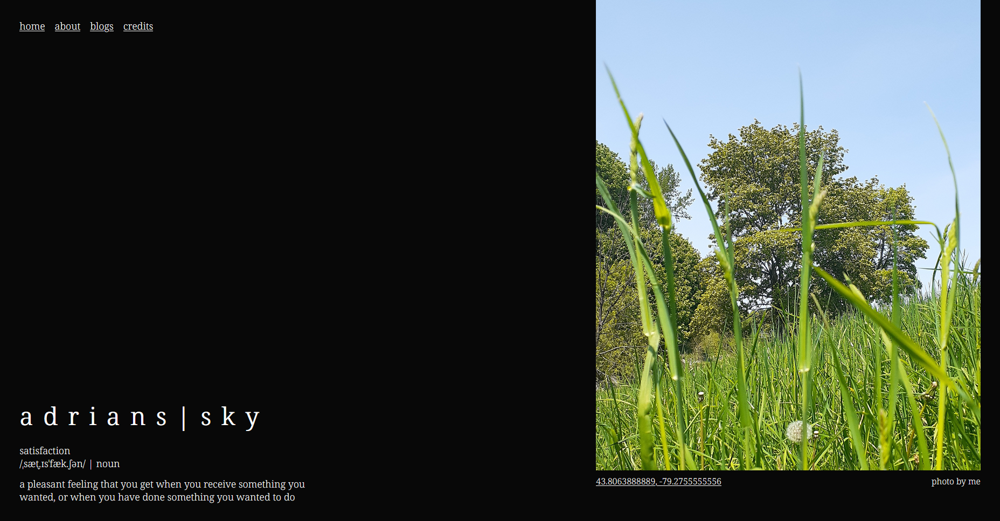
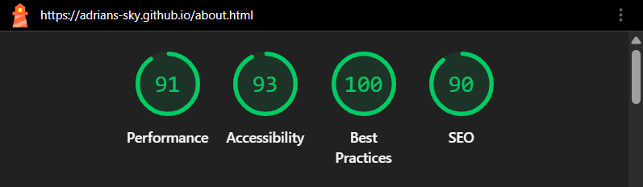

# adrians-sky.github.io

My personal, "not boring" portfolio and personal blog 
[website](https://adrians-sky.github.io). 

---

# Lighthouse Insights

> Generated on September 14, 2026 using Google Chrome.

# About

A personal website, blog, and portfolio built with HTML/CSS and hosted on 
GitHub pages. This site demonstrates responsive layouts, image optimization, and 
performance improvements using Google Lighthouse.

# Dependencies/Tools Used

## Core Technology

| Tool/Technology | Purpose |
|---|---|
| [HTML](https://developer.mozilla.org/en-US/docs/Web/HTML) | Website Structure Structure |
| [CSS](https://developer.mozilla.org/en-US/docs/Web/CSS) | Page Styling and Responsive Design |

## Hosting and Deployment

| Tool/Technology | Purpose |
|---|---|
| [Git](https://git-scm.com/) | Version Control |
| [GitHub Pages](https://docs.github.com/en/pages) | Site Hosting from Repository |
| [GitHub Workflow](https://docs.github.com/en/actions/concepts/workflows-and-actions/workflows) | Automated Deployment |

## Workflow and Development

| Tool/Technology | Purpose |
|---|---|
| [Neovim](https://neovim.io/) | Terminal Text Editor |
| [Mozilla Firefox](https://www.firefox.com/en-CA/) | Web Developer Tools |
| [Google Lighthouse](https://developer.chrome.com/docs/lighthouse/) | Performance, Accessibility, SEO Auditing |

## Visual Design and Inspiration

| Tool/Technology | Purpose |
|---|---|
| [Google Fonts](https://fonts.google.com/) | Free, Open Source Fonts |
| [Iconoir](https://iconoir.com/) | Free, Open Source Icons |
| [Porter Robinson's Nurture](https://music.youtube.com/playlist?list=OLAK5uy_ndpLYk1Pz5pO8uFoVPcSH_UVAoZFM5QII) | Aesthetics and Design Inspiration |

# Credits

My website's layout design is heavily inspired from Porter Robinson's 
[Nurture](https://music.youtube.com/playlist?list=OLAK5uy_kxKxwJ58EGkW3L2xmJFGi2efuZLjPeYuE&si=Obc4PyjhVnGuQsnI) album, 
one of my favourite albums ever.

All photos are taken by me unless stated otherwise.

# License

This project is available as open source under the [MIT License](LICENSE).
